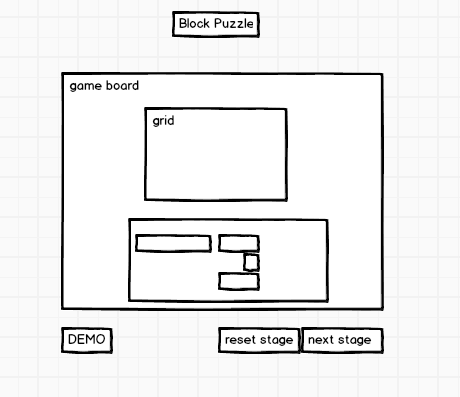

## Block Puzzle

### Background

Block Puzzle is a simple puzzle game where the user drags each puzzle piece into a fixed rectangular container. If the puzzles fit perfectly, the user will be directed to the next stage.

### Functionality & MVP  

The users will be able to:

- [ ] Reset the game board
- [ ] Drag pieces inside the board
- [ ] Click on demo to see how the game works (will use modal for demo)
- [ ] be able to choose different templates

In addition, this project will include:

- [ ] A production Readme

### Wireframes

This app will consist of a game board, game controls such as 'Demo' which will pop up a modal, 'reset', templates, and 'view solution', and links to my Github and LinkedIn.

### Architecture and Technologies

This project will be implemented with the following technologies:

- Vanilla JavaScript and `jquery` for overall structure and game logic,
- Use Canvas to draw blocks

`board.js`: this script will handle the logic for creating and updating the necessary `canvas` elements and rendering them to the DOM.

### Implementation Timeline

**Day 1**: Setup project file (all configuration files). Learn Easel.js and plan out puzzles for each stage.

**Day 2**: start writing `board.js`. Using `canvas`, be able to render blocks and grid.

**Day 3**: create the logic of the game. When the grid is filled without overlap, be able to move on to the next stage.

**Day 4**: Install the controls(reset,demo,nextstage) for the user to interact with the game.  Style the frontend.

### Bonus features

- [ ] have a move count which increments for each mouse event